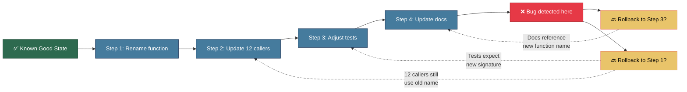

## Rationale

Agentic changes can compound rapidly. A single session may touch many files in quick succession, and later edits often assume that earlier ones succeeded. Once that happens, recovery is no longer a matter of undoing one line or one file. It becomes a question of how far back the codebase must move to regain internal consistency.

In agentic development, changes can compound rapidly. A single agent session may touch dozens of files in quick succession, creating a tightly coupled chain of edits. Later edits often assume that earlier ones succeeded. Rolling back to an intermediate state may therefore leave the codebase inconsistent: imports reference moved symbols, tests assert removed behaviour, and configurations point to renamed paths.



Without fine-grained checkpoints, rollback often becomes possible only at the beginning of the session because intermediate states are internally inconsistent.

## How to Apply the Pattern

Reversibility should be prepared before execution rather than improvised after failure.

1. Start from a verified baseline.
2. Create a checkpoint or isolated working state before risky work begins.
3. Commit or checkpoint each verified unit of progress.
4. Use rollback targets that correspond to meaningful states, not just arbitrary timestamps.
5. Choose the smallest rollback action that restores consistency.

The central objective is to make recovery cheap enough that teams actually use it when something goes wrong.

## Supporting Practices

### Use Multiple Rollback Mechanisms

| Mechanism | Description | When to Use |
|-----------|-------------|-------------|
| **Git commits** | Commit before each agent interaction | Always |
| **Branches** | Isolate experimental work | Risky changes |
| **Checkpoints** | Named save points for complex work | Multi-step tasks |
| **Backups** | For non-git artefacts | Databases, configs |
| **Snapshots** | Full environment state | Major changes |

### Start from a Verified Baseline

Before engaging an agent on any task, confirm the codebase is in a known-good state:

```bash
# Verify the baseline before any agent task
npm run lint    # or equivalent
npm test        # all tests should pass
git status      # no uncommitted changes
```

Starting from a broken or dirty state means it is impossible to distinguish agent-introduced failures from pre-existing ones. The baseline check is the precondition for any rollback strategy being meaningful.

### Create a Pre-Task Checkpoint

```bash
# Before any agent task
git add -A
git stash push -m "checkpoint: before agent task $(date +%Y%m%d-%H%M%S)"
# or
git commit -m "checkpoint: before [task description]"
git checkout -b agent/task-name
```

### Use a Rollback Decision Path

```
Change failed verification?
    │
    ├── Single file affected ──▶ git checkout -- file
    │
    ├── Multiple files, clear scope ──▶ git reset --hard HEAD~1
    │
    └── Unknown scope ──▶ Full rollback ──▶ Manual investigation
```

### Match the Rollback Level to the Failure Scope

| Level | Command | When |
|-------|---------|------|
| **Single file** | `git checkout -- path/to/file` | One file has issues |
| **Last commit** | `git reset --hard HEAD~1` | Recent commit was bad |
| **To checkpoint** | `git reset --hard <commit>` | Need to go back further |
| **Branch abandon** | `git checkout main; git branch -D agent/task` | Entire approach failed |
| **Stash restore** | `git stash pop` | Restore pre-task state |

## Practices

- Checkpoint after each coherent unit rather than after each individual file edit
- Commit after every verified step
- Use descriptive commit messages that capture *what is now consistent*
- Create branches for risky changes
- Document known-good states
- Test rollback procedures periodically
- Automate checkpoint creation before agent tasks
- Prefer small, self-contained agent tasks to limit the blast radius of compounding changes
- Use git worktrees for parallel or experimental agent sessions
- Consider branching strategies that make agent work explicit and reviewable before it reaches the main branch
- Tag AI-generated branches to distinguish them from human-authored branches

## Anti-patterns

- Working on the main branch directly
- Large uncommitted change sets
- No checkpoint before risky operations
- Assuming rollback will be easy
- Not testing rollback procedures

## Indicators

- Time required to return the repository to a known-good state after failure
- Frequency with which teams can roll back one verified unit rather than abandoning the full session
- Number of verified checkpoints created during multi-step tasks
- Incidence of inconsistent intermediate states after attempted rollback
